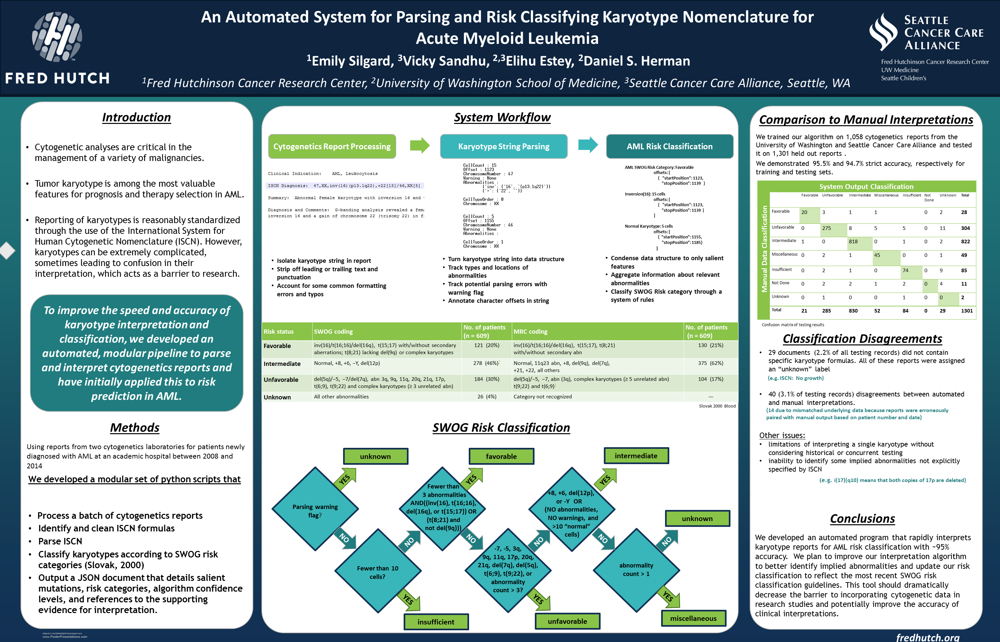

# fhcrc_cytogenetics
=================================================================================================

This is the primary directory for the Fred Hutch cytogenetics processing pipeline
----------------------------------------------------------------------------------------------------------------

- global_strings.py: a set of string variables used in various scripts in this directory
- heme: a directory of algorithms specific to hematalogical malignancies. Currently only home to classify_heme_swog_category.py, which gives a prognostic risk classification for the given karyotype according to the AML SWOG classification system outlined by the [2010 Slovak paper](http://www.bloodjournal.org/content/96/13/4075.long?sso-checked=true). 
- iscn_parser.py: a program to parse the cleaned karyotype string into a queryable data structure [ISCN formatting guidelines](http://www.cydas.org/Docs/ISCNAnalyser/Analysis.html)
- iscn_string_cleaner.py: a simple script to clean up the ISCN string by stripping off trailing or leading free text, accounting for common and unambiguous formatting irregularities and in some cases assigning a risk stratification based upon free text
- parser.py: parses the tab delimited cytogenetics report (this is institution/source system specific)
- process.py: the primary error handling and processing script for the cytogenetics pipeline
